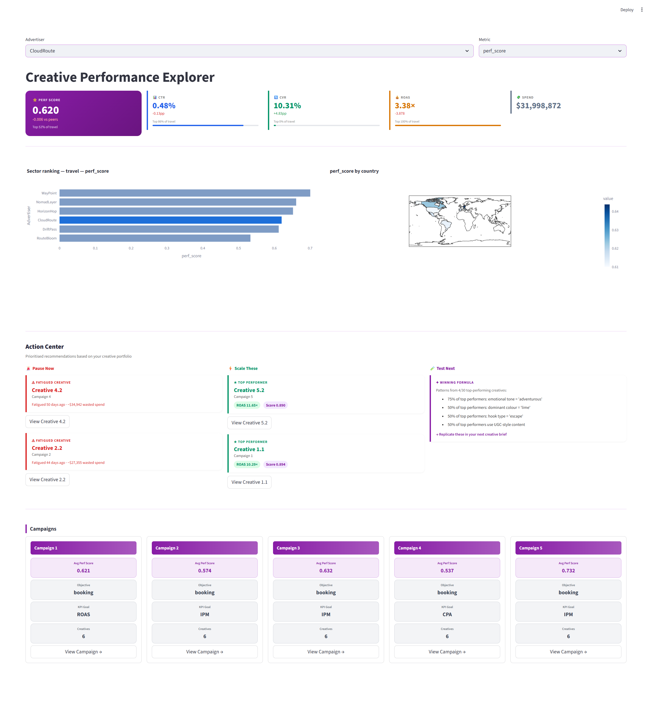
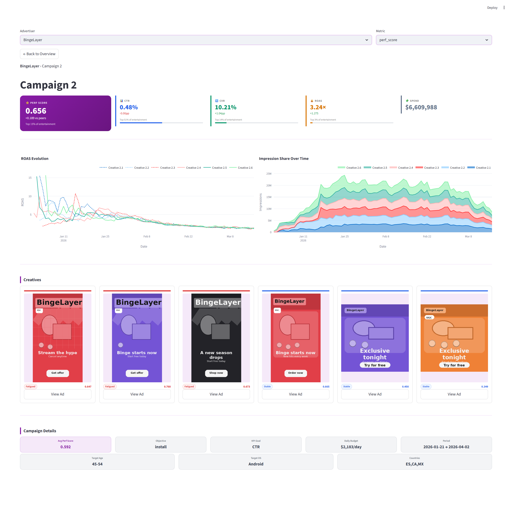
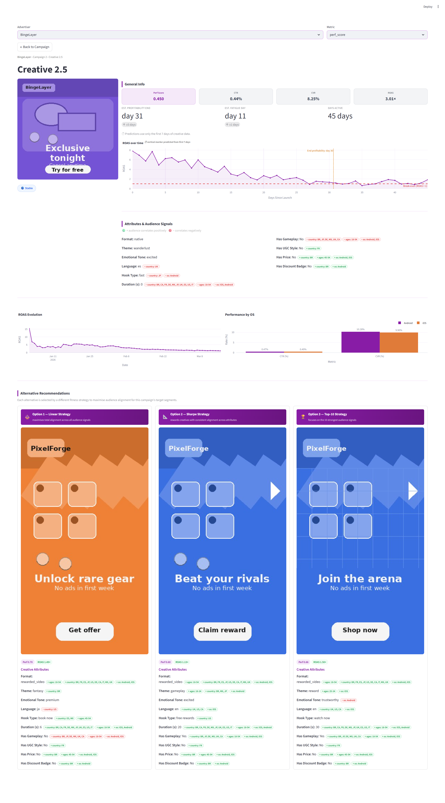

# Smadex Creative Intelligence

HackUPC 2026 — Ad creative performance & fatigue analysis dashboard.

Built for the [Smadex Creative Intelligence Challenge](docs/hackathon-brief.md): help mobile advertisers understand which creatives work, why, and when they fatigue.

## Features

- **Portfolio overview** — KPI cards (perf score, CTR, CVR, ROAS), peer rank bar chart, geo-OS heatmap
- **Action Center** — automated "Pause Now" and "Scale Up" recommendations driven by fatigue status and percentile rank
- **Campaign drill-down** — ROAS evolution and impression share trends per creative
- **Creative detail** — audience signal correlation tags, fatigue/profitability predictions with uncertainty estimates
- **Alternative recommendations** — three fitness-scored alternatives (Linear ⚖️, Sharpe 📐, Top-K 🏆) for each creative

## Dashboard


*Advertiser overview: KPI cards, peer ranking bar chart, geographic heatmap, and the Action Center.*


*Campaign drill-down: ROAS evolution, impression share trends, and creative thumbnail grid.*


*Creative detail: fatigue prediction, audience signal correlations, and alternative recommendations.*

## Requirements

- Python ≥ 3.12
- [uv](https://docs.astral.sh/uv/) (package manager)
- NVIDIA GPU with CUDA 12.6 — required only for embedding generation; the dashboard runs on CPU

## Setup

```bash
# 1. Install uv (if not already installed)
curl -LsSf https://astral.sh/uv/install.sh | sh

# 2. Install dependencies
uv sync

# 3. Install pre-commit hooks
uv run pre-commit install
```

## Running the Dashboard

```bash
uv run streamlit run main.py
```

## Generating Embeddings (GPU required)

The embedding generation script processes all 1,080 creative PNGs through Gemma 4 and saves the result to `data/embeddings/creative_embeddings.npz`. Run it once on a machine with an NVIDIA GPU:

```bash
uv run python src/embeddings/generate_embeddings.py

# Resume an interrupted run:
uv run python src/embeddings/generate_embeddings.py --resume
```

## Pre-computing Correlation Analysis

The correlation engine computes how each creative attribute (text density, novelty score, theme, emotional tone, etc.) correlates with a performance metric, broken down by audience segment (age group, country, OS, vertical, etc.). Results are saved as Parquet files and can be loaded instantly in the dashboard.

Two methods are available:

- `statistical` — Pearson correlation with p-value; per-level scores for categorical attributes
- `rf_signed` — Random Forest feature importance signed by the direction of the Pearson correlation (captures non-linear relationships while preserving sign)

```bash
# Statistical correlations for perf_score (default)
uv run python scripts/precompute_correlations.py --method statistical --metric perf_score

# RF signed importances for CTR
uv run python scripts/precompute_correlations.py --method rf_signed --metric overall_ctr

# Run all 8 combinations (2 methods × 4 metrics)
uv run python scripts/precompute_correlations.py --all
```

Output: `data/correlations/correlations_{method}_{metric}.parquet`

Each file is a flat table with one row per `(segment, creative attribute level)`. Segment dimensions include `target_age_segment`, `country`, `os`, `vertical`, `objective`, `target_os`, and `hq_region`. To add a new dimension or attribute, extend the `CREATIVE_ATTRIBUTES` or `USER_CHARACTERISTICS` dicts in `src/analysis/correlation_engine.py`.

## Project Structure

```
smadex/
├── main.py                  # Streamlit entry point — run with: uv run streamlit run main.py
├── pyproject.toml           # Dependencies and tool config (uv)
│
├── scripts/                 # Offline pre-computation scripts
│   └── precompute_correlations.py  # Generate correlation Parquet files
│
├── src/                     # All application source code
│   ├── data/                # Data loading and preprocessing utilities
│   ├── embeddings/          # Embedding generation (generate_embeddings.py) and loading
│   ├── analysis/            # correlation_engine.py — segment × attribute correlations
│   ├── features/            # Feature engineering
│   ├── models/              # ML classifiers and rankers
│   └── dashboard/           # Streamlit pages and components
│
├── data/                    # Dataset (not committed — provided by Smadex)
│   ├── advertisers.csv
│   ├── campaigns.csv
│   ├── creatives.csv
│   ├── creative_summary.csv
│   ├── creative_daily_country_os_stats.csv
│   ├── campaign_summary.csv
│   ├── data_dictionary.csv
│   ├── assets/              # 1,080 synthetic creative PNGs
│   ├── embeddings/          # Generated embeddings (creative_embeddings.npz)
│   └── correlations/        # Pre-computed correlation Parquet files
│
├── notebooks/               # Exploratory analysis notebooks (01–07)
└── docs/                    # Project documentation and insights
```

## Key Data Files

| File | Description |
|------|-------------|
| `data/creative_summary.csv` | One row per creative — aggregated KPIs + `creative_status` label |
| `data/creative_daily_country_os_stats.csv` | Granular daily data — use for fatigue detection |
| `data/creatives.csv` | Creative metadata + `asset_file` path to PNG |
| `data/data_dictionary.csv` | Column definitions for all files |

Join keys: `advertiser_id → campaign_id → creative_id`

## Dataset Overview

| Entity | Count |
|--------|-------|
| Advertisers | 36 |
| Campaigns | 180 (5 per advertiser) |
| Creatives | 1,080 (6 per campaign) |
| Daily rows | 192,315 |

All data is synthetic. See [docs/insights.md](docs/insights.md) for EDA findings and [docs/hackathon-brief.md](docs/hackathon-brief.md) for the challenge brief.

## Correlation Engine, Fitness Score, and Creative Recommendations

This project uses a two-step ranking pipeline:

1. `CorrelationEngine` pre-computes audience-specific signal tables.
2. `CreativeFitnessScorer` ranks creatives against those signals for a target audience.

### 1) How Correlations Are Defined and Calculated

The correlation output (`data/correlations/correlations_{method}_{metric}.parquet`) has one row per:

- user segment (`user_characteristic`, `user_characteristic_value`)
- creative attribute (`creative_attribute`)
- optional attribute level (`creative_attribute_level`, used for categorical variables)

Each row stores:

- `correlation`: signed association score with the selected metric (`perf_score`, `overall_ctr`, `overall_cvr`, `overall_roas`)
- `p_value`: significance estimate from Pearson correlation
- `n_creatives`: number of creatives used to compute that row

Segment construction:

- `campaign` and `summary` characteristics filter `creative_summary` directly.
- `daily` characteristics (`country`, `os`) filter daily rows, aggregate by creative, recompute the target metric, then join creative attributes.
- Segments with fewer than 30 creatives are skipped (`MIN_CREATIVES_THRESHOLD = 30`).

Methods:

- `statistical`: Pearson correlation per attribute (or per one-hot level for categoricals).
- `rf_signed`: Random Forest feature importance, multiplied by the sign of Pearson correlation to keep directionality.

### 2) How the Fitness Score Is Defined and Calculated

Given a target audience (for example `[('country', 'US'), ('os', 'iOS')]`), the scorer first builds a weighted profile by averaging correlation rows across matching segments:

$$
\bar{r}_{a} = \frac{\sum_s r_{s,a} \cdot n_{s,a}}{\sum_s n_{s,a}}
$$

Where:

- $a$ is a single feature used by the scorer
	- for numeric/binary features, $a$ is the original column
	- for categorical features, one-hot encoding is applied and each dummy column (for example `theme__gameplay`) is treated as its own unique $a$
- $s$ is a selected segment
- $r$ is the correlation from the precomputed table
- $n$ is the number of creatives used to compute that correlation (used for weighting)

Only rows with `p_value < significance_threshold` (default `0.05`) are kept.

Then each creative gets an attribute contribution vector:

- Numeric / binary attribute:

$$
c_{i,a} = x_{i,a} \cdot \bar{r}_a
$$

- One-hot encoded categorical feature (same form as binary):

$$
c_{i,a} = x_{i,a} \cdot \bar{r}_{a}, \quad x_{i,a} \in \{0,1\}
$$

Scoring options implemented in `src/analysis/fitness_scorer.py`:

- `LinearFitnessScorer`: $\sum c$ (max total alignment)
- `SharpeCorrelationScorer`: $\mathrm{mean}(c)/(\mathrm{std}(c)+\epsilon)$ (prefer consistent alignment)
- `TopKFitnessScorer`: sum after keeping only top-$K$ attributes by max $|\bar{r}|$

The output is a `fitness_score` per `creative_id`, sorted descending.

### 3) How This Is Used to Recommend New Creatives

Recommendation flow:

1. Choose target audience segments and business metric.
2. Load the matching precomputed correlation table.
3. Score all existing creatives with one of the fitness scorers.
4. Use top-ranked creatives as reference candidates for new creative briefs.
5. Derive attribute guidance from contribution signs:
	- positive contribution attributes are good candidates to include or emphasize
	- negative contribution attributes are candidates to reduce or avoid for that audience

In practice, this supports "next creative" recommendations by turning historical performance into an audience-conditioned attribute profile, then ranking which creative patterns should be replicated. In the dashboard, the Creative Detail view surfaces three alternative creatives — one per scorer strategy — each with attribute pills showing which signals drove the recommendation.
